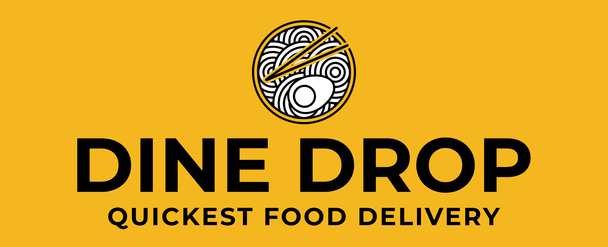

# DineDrop

DineDrop is an open-source project aimed at creating a platform similar to Uber Eats that allows customers to order food from local restaurants. Our mission is to make it easy for people to discover new restaurants and support local businesses.

## Projects

Here are the main projects that we are currently working on:

- [DineDrop Mobile App](https://github.com/DineDrop/mobile-app): A mobile application that allows customers to browse and order from local restaurants on the go.

## Contributing

We welcome contributions from anyone who is interested in our projects. To contribute, please follow these steps:

1. Fork the repository
2. Clone the repository to your local machine
3. Create a new branch for your changes
4. Make your changes and commit them
5. Push your changes to your forked repository
6. Submit a pull request to the original repository

## Code of Conduct

We expect all contributors to adhere to our Code of Conduct, which outlines our expectations for behavior within the organization and its projects. Please review the [Code of Conduct](https://github.com/DineDrop/code-of-conduct) before contributing.

## Contact

If you have any questions or would like to get in touch with us, please email us at [contact@dinedrop.com](mailto:rhythmshandlya@gmail.com)

## License

All projects within the DineDrop organization are licensed under the [MIT License](https://opensource.org/licenses/MIT).
